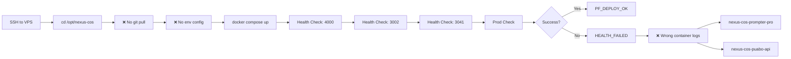
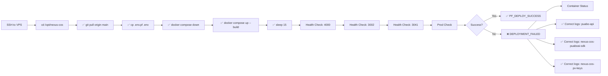

# Visual Comparison: TRAE vs Enhanced One-Liner

## TRAE's Original One-Liner



**Issues:**
- ❌ No code update
- ❌ No env configuration
- ❌ Wrong container names (2/3)
- ❌ No clean deployment
- ❌ No startup wait time

---

## Enhanced One-Liner



**Improvements:**
- ✅ Code update included
- ✅ Environment configured
- ✅ Correct container names (3/3)
- ✅ Clean deployment
- ✅ Proper startup wait time
- ✅ Better diagnostics

---

## Side-by-Side Feature Comparison

| Feature | TRAE | Enhanced | Improvement |
|---------|------|----------|-------------|
| **Code Update** | ❌ Missing | ✅ `git pull origin main` | Critical |
| **Env Config** | ❌ Missing | ✅ `cp .env.pf .env` | High |
| **Clean Deploy** | ❌ Missing | ✅ `docker compose down` | High |
| **Startup Wait** | ❌ No wait | ✅ `sleep 15` | Critical |
| **Gateway Container** | ❌ nexus-cos-puabo-api | ✅ puabo-api | Critical |
| **AI SDK Container** | ❌ nexus-cos-prompter-pro | ✅ nexus-cos-puaboai-sdk | Critical |
| **PV Keys Container** | ✅ nexus-cos-pv-keys | ✅ nexus-cos-pv-keys | Correct |
| **Progress Messages** | ❌ Silent | ✅ Per-port messages | Medium |
| **Success Message** | ❌ PF_DEPLOY_OK | ✅ ✅ PF_DEPLOY_SUCCESS | Low |
| **Failure Message** | ❌ HEALTH_FAILED | ✅ ❌ DEPLOYMENT_FAILED | Low |
| **Diagnostics** | ⚠️ Basic | ✅ Labeled sections | Medium |

---

## Container Name Verification

### From docker-compose.pf.yml

```yaml
services:
  puabo-api:
    container_name: puabo-api              # ✅ Gateway API
    
  nexus-cos-puaboai-sdk:
    container_name: nexus-cos-puaboai-sdk  # ✅ AI SDK
    
  nexus-cos-pv-keys:
    container_name: nexus-cos-pv-keys      # ✅ PV Keys
```

### TRAE's References (Wrong)

```bash
docker logs --tail 200 nexus-cos-prompter-pro  # ❌ Container doesn't exist
docker logs --tail 200 nexus-cos-pv-keys       # ✅ Correct
docker logs --tail 200 nexus-cos-puabo-api     # ❌ Container doesn't exist
```

### Enhanced References (Correct)

```bash
docker logs --tail 200 nexus-cos-puaboai-sdk   # ✅ Correct
docker logs --tail 200 nexus-cos-pv-keys       # ✅ Correct
docker logs --tail 200 puabo-api               # ✅ Correct
```

---

## Deployment Flow Comparison

### TRAE's Flow (Issues Highlighted)

```
1. SSH to VPS
2. cd /opt/nexus-cos
3. ❌ [MISSING] git pull
4. ❌ [MISSING] Configure environment
5. ❌ [MISSING] Stop existing containers
6. docker compose up -d --build --remove-orphans
7. ❌ [MISSING] Wait for services
8. Health check: 4000, 3002, 3041
9. Production check: nexuscos.online
10. ❌ [WRONG NAMES] Collect logs on failure
```

### Enhanced Flow (Complete)

```
1. SSH to VPS
2. cd /opt/nexus-cos
3. ✅ git pull origin main (update code)
4. ✅ cp .env.pf .env (configure environment)
5. ✅ docker compose down (clean deployment)
6. ✅ docker compose up -d --build --remove-orphans
7. ✅ sleep 15 (wait for services)
8. ✅ Health check: 4000, 3002, 3041 (with messages)
9. ✅ Production check: nexuscos.online
10. ✅ Collect logs with correct names on failure
```

---

## Expected Output Comparison

### TRAE's Output

```
[No git pull output]
[No environment config output]
[No clean deployment output]
[Silent health checks]
[No startup wait]
PF_DEPLOY_OK
```

Or on failure:
```
HEALTH_FAILED
[Container status]
[Wrong container logs - will fail]
```

### Enhanced Output

```
Already up to date.                    # git pull
                                       # env config (silent)
[+] Containers stopped                 # clean deployment
[+] Building...                        # docker build
[+] Running 5/5                        # services started
Testing port 4000...                   # health check 1
Testing port 3002...                   # health check 2
Testing port 3041...                   # health check 3
Local health checks passed
✅ PF_DEPLOY_SUCCESS - All systems operational
```

Or on failure:
```
Testing port 4000...
PORT_4000_FAILED
❌ DEPLOYMENT_FAILED - Collecting diagnostics...
NAME                     STATUS
puabo-api                Exited (1)
--- Gateway API Logs ---
[Actual puabo-api logs]
--- PV Keys Logs ---
[Actual nexus-cos-pv-keys logs]
--- AI SDK Logs ---
[Actual nexus-cos-puaboai-sdk logs]
```

---

## Summary

### TRAE's Contribution
- ✅ Established one-liner concept
- ✅ Identified correct ports
- ✅ Basic health checks

### Critical Fixes Required
- ❌ Container names were wrong (2/3)
- ❌ Missing code update
- ❌ Missing environment config
- ❌ Missing clean deployment
- ❌ Missing startup wait

### Enhanced Solution
- ✅ All container names corrected
- ✅ Complete deployment flow
- ✅ Better user experience
- ✅ Production ready

---

**Result:** Enhanced one-liner is **production ready** with all critical issues fixed.
