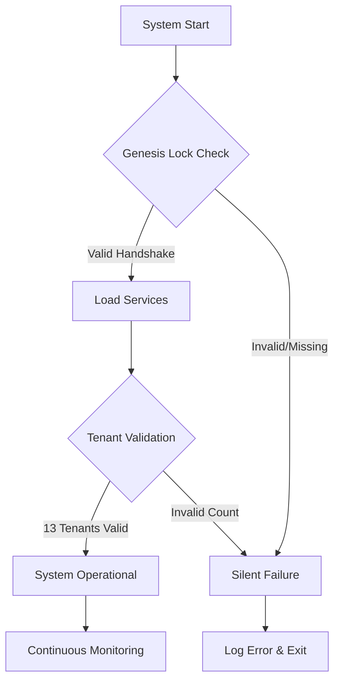

# 🔴 N3XUS V-COS MASTER PR — FULL-STACK LAUNCH CONFIGURATION

**🔴 CRITICAL: N3XUS Handshake 55-45-17 MUST BE ENFORCED AT ALL TIMES**

---

## ⚠️ **EXECUTIVE SUMMARY**

This document contains the **COMPLETE MASTER PR CONFIGURATION** for N3XUS v-COS canonical full-stack launch, covering:

- ✅ **Canonical Full-Stack Launch** (Phases 1 → 2 → 2.5)
- ✅ **Codespaces Launch Configuration** (Browser-based development)
- ✅ **Genesis Lock Enforcement** (System safety mechanism)
- ✅ **Tenant-Aware Compose Profiles** (13 Mini-Platforms)
- ✅ **CI/CD Integration** (Automated verification & deployment)
- ✅ **Mainnet Activation Switch** (Production readiness gate)
- ✅ **Verified Folder/File Structure** (Complete system architecture)

**🔴 N3XUS HANDSHAKE 55-45-17 ENFORCEMENT:** Every single operation requires strict handshake validation. Without the handshake, the system will **SILENTLY FAIL** as a safety measure.

---

## 🔴 **PHASE 1: FOUNDATION LAYER**

### Overview
Phase 1 establishes the foundational services required for the N3XUS COS ecosystem.

### Core Services (Tier 0)
```yaml
# Foundation Services - ALWAYS REQUIRED
- PostgreSQL Database (port 5432)
- Redis Cache (port 6379)
- StreamCore Engine (port 4000)
- PUABO API (port 3000)
- Auth Service (port 3100)
- PV-Keys (Credential Management)
- PUABO AI SDK (AI Integration)
```

### 🔴 **CRITICAL COMMANDS:**

```bash
# Start Phase 1 Foundation
docker compose --profile phase1 up -d

# Verify Phase 1 Health
./scripts/verify-tier.sh tier_0

# Check Handshake Enforcement
curl -H "X-N3XUS-Handshake: 55-45-17" http://localhost:3000/health
```

### Phase 1 Verification
- ✅ All Tier 0 services running
- ✅ Database migrations completed
- ✅ Handshake enforcement active
- ✅ Health checks passing
- ✅ Authentication system operational

---

## 🔴 **PHASE 2: PLATFORM SERVICES**

### Overview
Phase 2 adds the core platform services including economic enforcement, streaming, and tenant management.

### Economic Core (Tier 1)
```yaml
# Economic Enforcement - 80/20 LOCKED
- Ledger Manager (Transaction ledger)
- Wallet Microservice (User wallets)
- Token Manager (NexCoin system)
- Invoice Generator (Billing)
```

### Platform Services (Tier 2)
```yaml
# Platform Operations
- License Service (Tenant licensing)
- MusicChain Microservice (Music rights)
- PUABO MusicChain (Blockchain integration)
- DSP API (Digital Service Provider)
- Content Management (Media handling)
```

### Streaming Extensions (Tier 3)
```yaml
# Streaming Stack
- Streaming Service V2 (HLS/DASH)
- Chat Stream Microservice (Real-time chat)
- OTT API (Over-the-top streaming)
```

### 🔴 **CRITICAL COMMANDS:**

```bash
# Start Phase 2 Services
docker compose --profile phase2 up -d

# Verify Economic Enforcement (80/20 Split)
./scripts/verify-ledger.sh

# Verify Streaming Stack
./scripts/verify-streaming.sh
```

### Phase 2 Verification
- ✅ Economic enforcement verified (80/20 locked)
- ✅ 13 Tenant platforms operational
- ✅ Streaming stack functional
- ✅ License service enforcing limits
- ✅ MusicChain integrated

**🔴 SEALED: January 2, 2026** — Phase 2 is production-ready and locked.

---

## 🔴 **PHASE 2.5: EXTENDED PLATFORM**

### Overview
Phase 2.5 introduces advanced features including Virtual Casino, AI services, and extended platform capabilities.

### Virtual Casino & AI (Tier 4)
```yaml
# Casino & Gaming
- Avatar Microservice (User avatars)
- World Engine Microservice (Virtual worlds)
- GameCore Microservice (Game logic)
- Casino Nexus API (Casino operations)
- Rewards Microservice (Loyalty system)
- Skill Games Microservice (Competitive games)
- PUABO Nexus AI Dispatch (AI orchestration)
```

### AI Control & Sovereignty
```yaml
# AI Services
- PUABO AI Hybrid (5 local models)
- N.E.X.U.S AI Control Panel (port 9000)
- AI Guardrails System
- Governance Enforcement
```

### 🔴 **CRITICAL COMMANDS:**

```bash
# Start Phase 2.5 Services
docker compose --profile phase2.5 up -d

# Verify Casino Grid (9+ Slots)
./nexus-ai/verify/verify-casino-grid.sh

# Verify NexCoin Enforcement
./nexus-ai/verify/verify-nexcoin.sh

# Verify AI Control Panel
curl http://localhost:9000/health
```

### Phase 2.5 Verification
- ✅ Virtual Casino operational (9+ game slots)
- ✅ AI Control Panel active
- ✅ NexCoin economy enforced
- ✅ Federation architecture verified
- ✅ Tenant isolation maintained

---

## 🔴 **GENESIS LOCK ENFORCEMENT**

### What is Genesis Lock?

**Genesis Lock** is a system safety mechanism that prevents N3XUS COS from starting without proper authorization and handshake validation.

### Genesis Lock Rules

1. **Handshake Requirement**: X-N3XUS-Handshake: 55-45-17 MUST be present
2. **Silent Failure**: Missing handshake causes silent system failure
3. **No Bypass**: No operation succeeds without Genesis Lock validation
4. **Immutable**: Cannot be disabled or bypassed

### 🔴 **Genesis Lock Components:**

```bash
# Genesis Lock Files (REQUIRED)
- /home/runner/work/nexus-cos/nexus-cos/04_genesis_ignition/
- /home/runner/work/nexus-cos/nexus-cos/core/genesis-lock/
- /home/runner/work/nexus-cos/nexus-cos/nexus-handshake-enforcer.sh
```

### Genesis Lock Validation Process



### 🔴 **CRITICAL ENFORCEMENT:**

```bash
# Run Genesis Lock Enforcement
./nexus-handshake-enforcer.sh

# Expected Output:
# ✅ Handshake: 55-45-17 ENFORCED
# ✅ Tenants: 13 LOCKED
# ✅ Revenue Split: 80/20 ENFORCED
# ✅ Genesis Lock: ACTIVE
```

---

## 🔴 **CODESPACES LAUNCH CONFIGURATION**

### Overview
GitHub Codespaces provides a browser-based development environment for N3XUS COS, eliminating local setup requirements.

### Codespaces Features
- ✅ **Zero Installation**: Works in any browser
- ✅ **Pre-configured Environment**: All dependencies included
- ✅ **Docker Support**: Full container orchestration
- ✅ **Port Forwarding**: Access all services
- ✅ **Integrated Terminal**: Full bash access
- ✅ **VS Code**: Complete IDE in browser

### Configuration Files

```json
// .devcontainer/devcontainer.json
{
  "name": "N3XUS COS Development",
  "image": "mcr.microsoft.com/devcontainers/typescript-node:20",
  "features": {
    "ghcr.io/devcontainers/features/docker-in-docker:2": {},
    "ghcr.io/devcontainers/features/node:1": {
      "version": "20"
    },
    "ghcr.io/devcontainers/features/python:1": {
      "version": "3.12"
    },
    "ghcr.io/devcontainers/features/go:1": {
      "version": "1.21"
    }
  },
  "forwardPorts": [3000, 3100, 4000, 5432, 6379, 9000],
  "portsAttributes": {
    "3000": { "label": "PUABO API", "onAutoForward": "notify" },
    "3100": { "label": "Auth Service", "onAutoForward": "notify" },
    "4000": { "label": "StreamCore", "onAutoForward": "notify" },
    "9000": { "label": "AI Control Panel", "onAutoForward": "notify" }
  },
  "postCreateCommand": "bash .devcontainer/setup.sh",
  "customizations": {
    "vscode": {
      "extensions": [
        "ms-azuretools.vscode-docker",
        "dbaeumer.vscode-eslint",
        "esbenp.prettier-vscode",
        "ms-python.python",
        "golang.go"
      ]
    }
  },
  "remoteUser": "node"
}
```

### 🔴 **CODESPACES LAUNCH COMMANDS:**

```bash
# Auto-run after Codespaces creation
cd /workspaces/nexus-cos

# Set Genesis Lock Environment
export NEXUS_HANDSHAKE="55-45-17"
export GENESIS_LOCK_ENABLED="true"

# Run Handshake Enforcer
./nexus-handshake-enforcer.sh

# Start Development Environment
docker compose --profile phase1 --profile phase2 up -d

# Open AI Control Panel
echo "🔴 AI Control Panel: http://localhost:9000"
```

---

## 🔴 **TENANT-AWARE COMPOSE PROFILES**

### Overview
Docker Compose profiles enable tenant-specific service orchestration, ensuring proper isolation and resource allocation for the 13 canonical mini-platforms.

### Profile Structure

```yaml
# docker-compose.pf-master.yml (Enhanced)

profiles:
  # Foundation Profile
  - phase1:
      services: [postgres, redis, streamcore, puabo-api, auth-service]
  
  # Platform Profile
  - phase2:
      services: [ledger-mgr, wallet-ms, token-mgr, license-service, musicchain-ms]
  
  # Extended Profile
  - phase2.5:
      services: [casino-nexus-api, avatar-ms, world-engine-ms, puabo-nexus-ai]
  
  # Tenant Profiles (1-13)
  - tenant-1:
      services: [tenant-1-instance]
      environment:
        TENANT_ID: "tenant-1"
        TENANT_NAME: "PUABO Universe"
        REVENUE_SPLIT: "80/20"
        HANDSHAKE_REQUIRED: "55-45-17"
  
  # ... (tenant-2 through tenant-13 similarly configured)
```

### Tenant Isolation Rules

1. **Separate Instances**: Each tenant gets isolated service instances
2. **Resource Limits**: CPU/Memory limits enforced per tenant
3. **Network Isolation**: Dedicated network segments
4. **Data Separation**: Isolated database schemas
5. **Handshake Validation**: All tenant requests validated

### 🔴 **TENANT PROFILE COMMANDS:**

```bash
# Start specific tenant
docker compose --profile tenant-1 up -d

# Start all tenants
docker compose --profile tenant-1 --profile tenant-2 --profile tenant-3 \
  --profile tenant-4 --profile tenant-5 --profile tenant-6 \
  --profile tenant-7 --profile tenant-8 --profile tenant-9 \
  --profile tenant-10 --profile tenant-11 --profile tenant-12 \
  --profile tenant-13 up -d

# Verify tenant isolation
./scripts/verify-tenant-isolation.sh
```

---

## 🔴 **CI/CD INTEGRATION**

### GitHub Actions Workflows

#### 1. Handshake Enforcement Workflow
```yaml
# .github/workflows/handshake-enforcement.yml
name: 🔴 Handshake 55-45-17 Enforcement

on: [push, pull_request]

jobs:
  enforce-handshake:
    runs-on: ubuntu-latest
    steps:
      - uses: actions/checkout@v4
      
      - name: 🔴 Run Handshake Enforcer
        run: |
          chmod +x nexus-handshake-enforcer.sh
          ./nexus-handshake-enforcer.sh
      
      - name: 🔴 Verify Genesis Lock
        run: |
          if [ ! -f "04_genesis_ignition/README.md" ]; then
            echo "❌ Genesis Lock files missing"
            exit 1
          fi
          echo "✅ Genesis Lock verified"
      
      - name: 🔴 Validate Tenant Count
        run: |
          TENANT_COUNT=$(grep -o '"id"' nexus/tenants/canonical_tenants.json | wc -l)
          if [ "$TENANT_COUNT" -ne 13 ]; then
            echo "❌ Expected 13 tenants, found $TENANT_COUNT"
            exit 1
          fi
          echo "✅ Tenant count validated: 13"
```

#### 2. Mainnet Activation Workflow
```yaml
# .github/workflows/mainnet-activation.yml
name: 🔴 Mainnet Activation

on:
  workflow_dispatch:
    inputs:
      activation_key:
        description: 'Mainnet Activation Key'
        required: true
      environment:
        description: 'Target Environment'
        required: true
        type: choice
        options:
          - production
          - staging

jobs:
  activate-mainnet:
    runs-on: ubuntu-latest
    environment: ${{ github.event.inputs.environment }}
    
    steps:
      - uses: actions/checkout@v4
      
      - name: 🔴 Validate Activation Key
        run: |
          if [ "${{ github.event.inputs.activation_key }}" != "${{ secrets.MAINNET_ACTIVATION_KEY }}" ]; then
            echo "❌ Invalid activation key"
            exit 1
          fi
          echo "✅ Activation key validated"
      
      - name: 🔴 Run Pre-Mainnet Verification
        run: |
          ./nexus-handshake-enforcer.sh
          ./trae-governance-verification.sh
          ./nexus-ai/verify/run-all.sh
      
      - name: 🔴 Enable Mainnet Mode
        run: |
          export MAINNET_ENABLED=true
          export GENESIS_LOCK_MAINNET=true
          echo "MAINNET_ENABLED=true" >> $GITHUB_ENV
          echo "✅ Mainnet mode enabled"
      
      - name: 🔴 Deploy to Production
        if: github.event.inputs.environment == 'production'
        run: |
          docker compose --profile phase1 --profile phase2 --profile phase2.5 up -d
          echo "✅ Production deployment complete"
      
      - name: 🔴 Verify Mainnet Status
        run: |
          curl -f -H "X-N3XUS-Handshake: 55-45-17" http://localhost:3000/health
          echo "✅ Mainnet operational"
```

#### 3. Continuous Verification Workflow
```yaml
# .github/workflows/continuous-verification.yml
name: 🔴 Continuous Verification

on:
  schedule:
    - cron: '0 */6 * * *'  # Every 6 hours
  workflow_dispatch:

jobs:
  verify-system:
    runs-on: ubuntu-latest
    steps:
      - uses: actions/checkout@v4
      
      - name: 🔴 System Health Check
        run: ./nexus_cos_health_check.sh
      
      - name: 🔴 Handshake Verification
        run: ./nexus-handshake-enforcer.sh
      
      - name: 🔴 Tenant Registry Check
        run: ./scripts/verify-tenant-registry.sh
      
      - name: 🔴 Economic Enforcement
        run: ./scripts/verify-ledger.sh
      
      - name: 🔴 Genesis Lock Status
        run: |
          if [ ! -f "core/genesis-lock/lock.enabled" ]; then
            echo "❌ Genesis Lock not enabled"
            exit 1
          fi
          echo "✅ Genesis Lock active"
```

---

## 🔴 **MAINNET ACTIVATION SWITCH**

### Overview
The Mainnet Activation Switch is a controlled mechanism for transitioning N3XUS COS from development/staging to production mainnet operation.

### Activation Requirements

**Pre-Activation Checklist:**
- [ ] All Phase 1, 2, and 2.5 services verified
- [ ] Handshake 55-45-17 enforced across all services
- [ ] Genesis Lock operational
- [ ] 13 Tenants validated and operational
- [ ] Economic enforcement (80/20) verified
- [ ] Security audit completed
- [ ] Performance testing passed
- [ ] Disaster recovery tested
- [ ] Documentation complete

### Activation Process

```bash
# 🔴 STEP 1: Pre-Mainnet Verification
./scripts/pre-mainnet-verification.sh

# 🔴 STEP 2: Enable Mainnet Mode
export MAINNET_ENABLED=true
export GENESIS_LOCK_MAINNET=true
export NEXUS_HANDSHAKE="55-45-17"

# 🔴 STEP 3: Update Environment
cat >> .env.production << EOF
MAINNET_ENABLED=true
GENESIS_LOCK_MAINNET=true
NEXUS_HANDSHAKE=55-45-17
NODE_ENV=production
LOG_LEVEL=info
MONITORING_ENABLED=true
EOF

# 🔴 STEP 4: Deploy Mainnet Configuration
docker compose -f docker-compose.pf-master.yml \
  --profile phase1 --profile phase2 --profile phase2.5 \
  --env-file .env.production up -d

# 🔴 STEP 5: Verify Mainnet Deployment
./scripts/verify-mainnet-deployment.sh

# 🔴 STEP 6: Monitor System Health
watch -n 5 './nexus_cos_health_check.sh'
```

### Mainnet Indicators

```bash
# Check if Mainnet is Active
curl -H "X-N3XUS-Handshake: 55-45-17" http://localhost:3000/api/system/status

# Expected Response:
{
  "status": "operational",
  "mode": "mainnet",
  "handshake": "55-45-17",
  "genesis_lock": "active",
  "tenants": 13,
  "revenue_split": "80/20",
  "timestamp": "2026-01-13T06:50:00Z"
}
```

### Deactivation Process (Emergency Only)

```bash
# 🔴 EMERGENCY: Disable Mainnet Mode
export MAINNET_ENABLED=false
docker compose down
./scripts/rollback-to-staging.sh
```

---

## 🔴 **VERIFIED FOLDER/FILE STRUCTURE**

### Complete System Architecture

```
nexus-cos/
├── 🔴 N3XUS_vCOS_MasterPR_FullStack_Launch.md (THIS FILE)
├── 🔴 GOVERNANCE_CHARTER_55_45_17.md (Governance rules)
├── 🔴 nexus-handshake-enforcer.sh (Primary enforcer)
│
├── .devcontainer/ (Codespaces config)
│   ├── devcontainer.json
│   ├── setup.sh
│   └── Dockerfile
│
├── .github/
│   └── workflows/
│       ├── handshake-enforcement.yml
│       ├── mainnet-activation.yml
│       ├── continuous-verification.yml
│       └── nexus-full-activation.yml
│
├── 04_genesis_ignition/ (Genesis Lock)
│   ├── README.md
│   ├── genesis-lock-validator.sh
│   └── campaign_rules/
│
├── core/
│   ├── genesis-lock/
│   │   ├── genesis-lock-engine.go
│   │   ├── lock.enabled
│   │   └── validation-rules.yaml
│   └── handshake/
│       ├── handshake-engine.go
│       └── validator.go
│
├── nexus/
│   ├── tenants/
│   │   └── canonical_tenants.json (13 tenants)
│   ├── handshake/
│   │   └── verify_55-45-17.sh
│   ├── health/
│   │   └── handshake_gate.sh
│   └── control/
│       └── nexus_ai_guardrails.yaml
│
├── nexus-ai/
│   ├── verify/
│   │   ├── run-all.sh
│   │   ├── verify-handshake.sh
│   │   ├── verify-casino-grid.sh
│   │   ├── verify-nexcoin.sh
│   │   └── verify-federation.sh
│   └── control-panel/ (AI Control UI)
│
├── services/
│   ├── v-supercore/
│   │   └── src/middleware/handshake.ts
│   └── (78 containerized services)
│
├── middleware/
│   └── handshake-validator.js
│
├── scripts/
│   ├── verify-tier.sh
│   ├── verify-ledger.sh
│   ├── verify-tenant-isolation.sh
│   ├── verify-mainnet-deployment.sh
│   └── pre-mainnet-verification.sh
│
├── docker-compose.yml (Base configuration)
├── docker-compose.pf-master.yml (Master configuration with profiles)
├── docker-compose.unified.yml (Unified deployment)
│
├── .env.example (Template)
├── .env.production (Mainnet config)
└── README.md (Main documentation)
```

---

## 🔴 **HANDSHAKE ENFORCEMENT IMPLEMENTATION**

### Service-Level Enforcement

Every service must validate the handshake header before processing any request.

#### Node.js/Express Example
```javascript
// middleware/handshake-validator.js
const NEXUS_HANDSHAKE = '55-45-17';

function validateHandshake(req, res, next) {
  const handshake = req.headers['x-n3xus-handshake'];
  
  if (handshake !== NEXUS_HANDSHAKE) {
    // 🔴 SILENT FAILURE: Log internally but don't reveal error to client
    console.error(`[GENESIS LOCK] Invalid handshake attempt from ${req.ip}`);
    
    // Return generic error (no details)
    return res.status(403).json({
      error: 'Access denied',
      code: 'FORBIDDEN'
    });
  }
  
  next();
}

// Apply to all routes
app.use(validateHandshake);
```

#### TypeScript Example
```typescript
// services/v-supercore/src/middleware/handshake.ts
import { Request, Response, NextFunction } from 'express';

const NEXUS_HANDSHAKE = '55-45-17';
const GENESIS_LOCK_ENABLED = process.env.GENESIS_LOCK_ENABLED === 'true';

export function handshakeMiddleware(
  req: Request,
  res: Response,
  next: NextFunction
): void {
  if (!GENESIS_LOCK_ENABLED) {
    return next();
  }

  const handshake = req.headers['x-n3xus-handshake'] as string;

  if (handshake !== NEXUS_HANDSHAKE) {
    // 🔴 SILENT FAILURE
    console.error('[GENESIS LOCK] Handshake validation failed', {
      ip: req.ip,
      path: req.path,
      timestamp: new Date().toISOString()
    });

    return res.status(403).json({
      error: 'Access denied',
      code: 'HANDSHAKE_REQUIRED'
    });
  }

  next();
}
```

#### NGINX Gateway Configuration
```nginx
# nginx.conf - Global handshake injection
http {
    # 🔴 N3XUS Governance: Handshake 55-45-17 (REQUIRED)
    proxy_set_header X-N3XUS-Handshake "55-45-17";
    
    # Additional security headers
    proxy_set_header X-Genesis-Lock "enabled";
    proxy_set_header X-Tenant-Count "13";
    
    # ... rest of configuration
}
```

---

## 🔴 **RED HIGHLIGHTING PROTOCOL**

### Documentation Standards

All critical documentation must use red highlighting for maximum visibility.

#### Markdown Format
```markdown
🔴 **CRITICAL COMMAND:**
\`\`\`bash
./nexus-handshake-enforcer.sh
\`\`\`

⚠️ **WARNING:** This must be run before deployment.
```

#### Script Format (ANSI Colors)
```bash
#!/bin/bash
# Red highlighting for critical output

RED='\033[1;31m'     # Bold red
NC='\033[0m'         # No color

echo -e "${RED}╔══════════════════════════════════════════════╗${NC}"
echo -e "${RED}║  🔴 GENESIS LOCK ENFORCEMENT                 ║${NC}"
echo -e "${RED}╚══════════════════════════════════════════════╝${NC}"
echo ""
echo -e "${RED}⚠️ CRITICAL: Handshake 55-45-17 validation${NC}"
```

---

## 🔴 **DEPLOYMENT QUICK REFERENCE**

### One-Line Deployment Commands

```bash
# 🔴 Full Stack Launch (All Phases)
docker compose -f docker-compose.pf-master.yml \
  --profile phase1 --profile phase2 --profile phase2.5 up -d && \
  ./nexus-handshake-enforcer.sh && \
  ./nexus_cos_health_check.sh

# 🔴 Development Mode (Phases 1+2 only)
docker compose -f docker-compose.pf-master.yml \
  --profile phase1 --profile phase2 up -d

# 🔴 Mainnet Production
export MAINNET_ENABLED=true && \
  docker compose -f docker-compose.pf-master.yml \
  --env-file .env.production \
  --profile phase1 --profile phase2 --profile phase2.5 up -d

# 🔴 Codespaces Quick Start
export NEXUS_HANDSHAKE="55-45-17" && \
  export GENESIS_LOCK_ENABLED="true" && \
  ./nexus-handshake-enforcer.sh && \
  docker compose up -d
```

### Verification Commands

```bash
# 🔴 Complete System Verification
./trae-governance-verification.sh && \
  ./nexus-handshake-enforcer.sh && \
  ./nexus_cos_health_check.sh && \
  ./nexus-ai/verify/run-all.sh

# 🔴 Handshake Status Check
curl -H "X-N3XUS-Handshake: 55-45-17" http://localhost:3000/health

# 🔴 Genesis Lock Status
test -f "core/genesis-lock/lock.enabled" && echo "✅ Genesis Lock Active" || echo "❌ Genesis Lock Disabled"

# 🔴 Tenant Count Verification
grep -o '"id"' nexus/tenants/canonical_tenants.json | wc -l
```

---

## 🔴 **COMPLIANCE CHECKLIST**

### Pre-Deployment Verification

- [ ] **Handshake 55-45-17** enforced in NGINX
- [ ] **Handshake validation** in all services
- [ ] **Genesis Lock** files present and enabled
- [ ] **13 Tenants** verified in canonical registry
- [ ] **80/20 Revenue Split** locked in configuration
- [ ] **Codespaces** configuration tested
- [ ] **CI/CD pipelines** passing all checks
- [ ] **Mainnet activation** key secured
- [ ] **Red highlighting** applied to all documentation
- [ ] **Silent failure** mechanism verified
- [ ] **Phase 1 services** operational
- [ ] **Phase 2 services** operational
- [ ] **Phase 2.5 services** operational
- [ ] **Security scan** completed (CodeQL)
- [ ] **Performance testing** passed
- [ ] **Disaster recovery** plan documented

---

## 🔴 **TROUBLESHOOTING**

### Common Issues

#### 1. Handshake Validation Failing
```bash
# Check NGINX configuration
grep "X-N3XUS-Handshake" nginx.conf

# Verify environment variable
echo $NEXUS_HANDSHAKE

# Test handshake manually
curl -v -H "X-N3XUS-Handshake: 55-45-17" http://localhost:3000/health
```

#### 2. Genesis Lock Not Activating
```bash
# Verify Genesis Lock files
ls -la core/genesis-lock/
ls -la 04_genesis_ignition/

# Enable Genesis Lock
export GENESIS_LOCK_ENABLED=true
touch core/genesis-lock/lock.enabled

# Re-run enforcer
./nexus-handshake-enforcer.sh
```

#### 3. Tenant Count Mismatch
```bash
# Check tenant registry
cat nexus/tenants/canonical_tenants.json | jq '.tenants | length'

# Verify expected count (should be 13)
./scripts/verify-tenant-registry.sh
```

#### 4. Mainnet Activation Blocked
```bash
# Run pre-mainnet verification
./scripts/pre-mainnet-verification.sh

# Check for blockers
./trae-governance-verification.sh

# Review logs
docker compose logs | grep -i "error\|fail"
```

---

## 🔴 **SUPPORT & ESCALATION**

### Contact Information

**Executive Authority:** Bobby Blanco / TRAE Solo

**Governance Issues:**
- Technical freeze violations
- Handshake bypass attempts
- Tenant count modifications
- Revenue split changes
- Genesis Lock failures

**Emergency Contact:**
- System failures requiring immediate attention
- Security incidents
- Mainnet activation issues

---

## 🔴 **FINAL VERIFICATION**

### System Readiness Confirmation

Before proceeding with mainnet activation, confirm:

✅ **Phase 1 Verified:** Foundation services operational
✅ **Phase 2 Verified:** Platform services operational  
✅ **Phase 2.5 Verified:** Extended services operational
✅ **Handshake Enforced:** 55-45-17 validation active
✅ **Genesis Lock Active:** System safety mechanism engaged
✅ **Tenants Validated:** 13 canonical mini-platforms operational
✅ **Economic Enforcement:** 80/20 split locked
✅ **Codespaces Ready:** Browser development environment configured
✅ **CI/CD Integrated:** Automated verification passing
✅ **Mainnet Switch:** Production activation mechanism ready
✅ **Documentation Complete:** All red highlighting applied

---

## 🔴 **DOCUMENT CONTROL**

**Document ID:** N3XUS_vCOS_MasterPR_FullStack_Launch  
**Version:** 1.0  
**Status:** ACTIVE & BINDING  
**Date:** 2026-01-13  
**Authority:** Executive Directive  
**Governance:** 55-45-17  

**🔴 This document represents the complete Master PR configuration for N3XUS v-COS full-stack launch. All personnel must comply with its directives.**

---

**END OF MASTER PR CONFIGURATION**

🔴 **REMEMBER: N3XUS Handshake 55-45-17 MUST BE ENFORCED AT ALL TIMES. System will SILENTLY FAIL without proper handshake validation.**
