# Windows Docker Desktop API Connection Fix - Complete Documentation

## 🎯 Quick Start

**Experiencing "failed to connect to the docker API at npipe:////./pipe/docker_engine"?**

```powershell
# Run PowerShell as Administrator
cd C:\path\to\nexus-cos
.\Fix-DockerDesktopWindows.ps1
```

That's it! The script handles everything and verifies success.

---

## 📚 Documentation Index

### 1. **Fix-DockerDesktopWindows.ps1** - AUTOMATED SCRIPT ⚡
   - One-command automated fix
   - Stops stale processes
   - Enables Windows features
   - Configures WSL2 backend
   - Resets Docker WSL distros
   - Verifies daemon health
   - **Fastest solution - use this first**

### 2. **WINDOWS_DOCKER_FIX_GUIDE.md** - COMPREHENSIVE GUIDE 📖
   - Detailed step-by-step instructions
   - Manual fix procedures
   - Advanced troubleshooting
   - Common issues and solutions
   - Performance optimization tips
   - Security considerations
   - **Read this for in-depth understanding**

### 3. **WINDOWS_DOCKER_FIX_README.md** - THIS FILE 📋
   - Quick reference index
   - Decision guide: which file to use
   - Problem summary
   - Solution overview
   - **Start here for navigation**

---

## ❓ Which File Should I Use?

### If you want the fastest fix:
→ Run **Fix-DockerDesktopWindows.ps1**
```powershell
.\Fix-DockerDesktopWindows.ps1
```

### If you want to understand the problem:
→ Read **WINDOWS_DOCKER_FIX_GUIDE.md** - [The Problem section]

### If you want manual control:
→ Follow **WINDOWS_DOCKER_FIX_GUIDE.md** - [Manual Fix Procedure section]

### If the script failed:
→ Review **WINDOWS_DOCKER_FIX_GUIDE.md** - [Advanced Troubleshooting section]

### If you have specific errors:
→ Check **WINDOWS_DOCKER_FIX_GUIDE.md** - [Common Issues & Solutions section]

### If you want to optimize performance:
→ See **WINDOWS_DOCKER_FIX_GUIDE.md** - [Performance Optimization section]

---

## 🚨 The Problem (In Simple Terms)

### What's Happening:
Windows Docker Desktop uses a "named pipe" (`\\.\pipe\docker_engine`) to communicate between:
- Docker CLI (what you type in PowerShell)
- Docker daemon (the background service that runs containers)

When this connection fails, you get the `npipe:////./pipe/docker_engine` error.

### Why It Happens:
1. **Stale Docker processes** - Old processes blocking the named pipe
2. **WSL2 misconfiguration** - Docker Desktop requires WSL2 on Windows
3. **Missing Windows features** - Hyper-V or WSL not enabled
4. **Corrupted WSL distros** - Docker's internal Linux distros in bad state
5. **Wrong engine mode** - Docker stuck on Windows engine instead of Linux

### Common Symptoms:
- ✗ `docker version` shows Client but no Server section
- ✗ `docker info` returns npipe connection error
- ✗ `docker ps` hangs or times out
- ✗ `docker run` commands fail immediately
- ✗ Docker Desktop icon shows error state
- ✗ `docker compose` doesn't work

---

## 🎯 The Solution (In Simple Terms)

### What the Fix Does:

1. **Stops all Docker processes**
   - Clears any stale processes blocking the named pipe
   - Terminates Docker WSL instances

2. **Enables Windows features** (if needed)
   - WSL (Windows Subsystem for Linux)
   - Virtual Machine Platform
   - Hyper-V
   - *May require Windows restart*

3. **Configures WSL2**
   - Sets WSL2 as default version
   - Ensures compatibility with Docker Desktop

4. **Resets Docker WSL distros**
   - Unregisters `docker-desktop` and `docker-desktop-data`
   - Forces clean recreation on next start
   - Fixes most configuration corruption

5. **Starts Docker Desktop**
   - Launches with clean state
   - Switches to Linux engine
   - Waits for initialization

6. **Verifies everything works**
   - Checks daemon health
   - Runs hello-world test
   - Validates Docker Compose
   - Reports any issues

---

## 🚀 Quick Command Reference

### Run the Automated Fix:
```powershell
# Full fix (recommended)
.\Fix-DockerDesktopWindows.ps1

# Skip Windows feature check (if already enabled)
.\Fix-DockerDesktopWindows.ps1 -SkipFeatureCheck

# Skip WSL reset (lighter troubleshooting)
.\Fix-DockerDesktopWindows.ps1 -SkipWSLReset

# Custom Docker installation path
.\Fix-DockerDesktopWindows.ps1 -DockerPath "D:\Docker\Docker"
```

### Manual Commands (if script fails):

```powershell
# Stop Docker processes
Stop-Process -Name "Docker Desktop" -Force
wsl --terminate docker-desktop
wsl --terminate docker-desktop-data

# Reset WSL distros
wsl --unregister docker-desktop
wsl --unregister docker-desktop-data

# Start Docker Desktop
Start-Process "C:\Program Files\Docker\Docker\Docker Desktop.exe"

# Wait for initialization (60-120 seconds)
Start-Sleep -Seconds 90

# Verify
& "C:\Program Files\Docker\Docker\resources\bin\docker.exe" info
```

### Validation Commands:
```powershell
# Check Docker version (should show Client + Server)
docker version

# Check Docker info (should show server details, no npipe error)
docker info

# Test with hello-world
docker run --rm hello-world

# Test Docker Compose
docker compose version
```

---

## 🔍 What Changed

### New Files Created:

1. **Fix-DockerDesktopWindows.ps1** (413 lines)
   - PowerShell automation script
   - Handles all fix steps automatically
   - Includes error handling and validation
   - Provides detailed progress output

2. **WINDOWS_DOCKER_FIX_GUIDE.md** (1000+ lines)
   - Comprehensive troubleshooting guide
   - Manual step-by-step procedures
   - Advanced troubleshooting section
   - Common issues database
   - Performance and security tips

3. **WINDOWS_DOCKER_FIX_README.md** (This file)
   - Quick reference and navigation
   - Problem/solution summary
   - Command reference

### No Existing Files Modified
This fix is purely additive - it doesn't modify any existing Nexus COS files.

---

## 📋 Prerequisites

Before running the fix, ensure you have:

- [ ] **Windows 10** (build 19041 or higher) or **Windows 11**
- [ ] **Administrator privileges** (right-click PowerShell → Run as Administrator)
- [ ] **BIOS virtualization enabled** (Intel VT-x or AMD-V)
- [ ] **At least 4GB RAM** available for Docker
- [ ] **At least 10GB free disk space**
- [ ] **Docker Desktop installed** (or will be installed)

### Check BIOS Virtualization:
```powershell
# Check if virtualization is enabled
systeminfo | findstr /i "Hyper-V"

# Or
Get-ComputerInfo | Select-Object HyperVisorPresent, HyperVRequirementVirtualizationFirmwareEnabled
```

If virtualization is disabled:
1. Restart and enter BIOS/UEFI (F2, F10, Del, or Esc during boot)
2. Find and enable VT-x (Intel) or AMD-V (AMD)
3. Save and exit
4. Boot Windows and run the fix script

---

## ✅ Success Indicators

After running the fix, you should see:

### Docker Version Output:
```
Client:
 Version:           24.0.6
 API version:       1.43
 ...

Server: Docker Desktop    ← Should be present
 Engine:
  Version:          24.0.6
  API version:      1.43
  ...
```

### Docker Info Output:
```
Server:
 Containers: 0
 Images: 1
 Server Version: 24.0.6
 Storage Driver: overlay2
 ...
 Operating System: Docker Desktop
 OSType: linux
 ...
```
**No npipe errors!**

### Hello-World Output:
```
Hello from Docker!
This message shows that your installation appears to be working correctly.
...
```

### Docker Compose Output:
```
Docker Compose version v2.23.0
```

---

## 🔧 Common Scenarios

### Scenario 1: Fresh Windows Install with No Docker
```powershell
# 1. Install Docker Desktop
winget install --id Docker.DockerDesktop -e

# 2. Run the fix script to ensure proper setup
.\Fix-DockerDesktopWindows.ps1

# 3. Verify
docker run --rm hello-world
```

---

### Scenario 2: Docker Installed but Getting npipe Errors
```powershell
# Just run the fix
.\Fix-DockerDesktopWindows.ps1

# That's it!
```

---

### Scenario 3: Script Failed or Partial Success
```powershell
# 1. Review the error messages from the script

# 2. Check BIOS virtualization is enabled
systeminfo | findstr /i "Hyper-V"

# 3. Try manual fix from WINDOWS_DOCKER_FIX_GUIDE.md
# Follow "Manual Fix Procedure" section

# 4. Check Advanced Troubleshooting section for specific errors
```

---

### Scenario 4: Corporate/Enterprise Environment
```powershell
# 1. Check with IT about:
#    - Firewall restrictions
#    - Antivirus exclusions for Docker
#    - Group policies blocking virtualization

# 2. Run with feature check skipped (IT may have enabled features)
.\Fix-DockerDesktopWindows.ps1 -SkipFeatureCheck

# 3. Verify with IT-approved testing
docker run --rm hello-world
```

---

## 🛠️ Troubleshooting Quick Reference

### Issue: "Access Denied" when running script
**Fix:** Run PowerShell as Administrator

---

### Issue: Windows restart required during script
**Fix:** Restart Windows and re-run the script

---

### Issue: "WSL 2 installation is incomplete"
**Fix:**
```powershell
wsl --update
```

---

### Issue: "Hardware assisted virtualization... is not enabled"
**Fix:** Enable VT-x/AMD-V in BIOS (see Prerequisites section)

---

### Issue: Docker Desktop crashes on startup
**Fix:**
```powershell
# Check logs
notepad "$env:AppData\Docker\log.txt"

# Try factory reset
# Docker Desktop → Troubleshoot → Reset to factory defaults
```

---

### Issue: Still getting npipe errors after fix
**Fix:**
```powershell
# Advanced reset
netsh winsock reset
Restart-Computer

# After reboot
.\Fix-DockerDesktopWindows.ps1
```

For more issues, see **WINDOWS_DOCKER_FIX_GUIDE.md** - [Common Issues & Solutions]

---

## 📞 Getting Help

### Built-in Docker Diagnostics:
```
Docker Desktop → Troubleshoot → Get support
```

### Gather Diagnostic Info:
```powershell
# Create diagnostic bundle
docker version > docker-diag.txt 2>&1
docker info >> docker-diag.txt 2>&1
wsl -l -v >> docker-diag.txt
systeminfo >> docker-diag.txt
```

### Useful Resources:
- [Docker Desktop for Windows Docs](https://docs.docker.com/desktop/windows/)
- [WSL2 Documentation](https://docs.microsoft.com/en-us/windows/wsl/)
- [Docker Forums](https://forums.docker.com/)

---

## 🎉 Result

Once the fix is complete successfully:
- ✅ Docker daemon responds via npipe
- ✅ `docker` commands work without errors
- ✅ `docker compose` functional
- ✅ WSL2 backend configured
- ✅ Can pull and run containers
- ✅ **READY FOR DEVELOPMENT**

---

## 📊 Fix Procedure Summary

```mermaid
graph TD
    A[Start] --> B[Stop Docker Processes]
    B --> C[Terminate WSL Docker]
    C --> D{Windows Features Enabled?}
    D -->|No| E[Enable WSL/Hyper-V/VMP]
    D -->|Yes| F[Configure WSL2]
    E --> G{Restart Required?}
    G -->|Yes| H[Restart Windows]
    G -->|No| F
    H --> F
    F --> I[Reset Docker WSL Distros]
    I --> J[Start Docker Desktop]
    J --> K[Wait for Initialization]
    K --> L[Switch to Linux Engine]
    L --> M[Verify Daemon Health]
    M --> N{Docker Healthy?}
    N -->|Yes| O[Test Hello-World]
    N -->|No| P[Advanced Troubleshooting]
    O --> Q{Test Passed?}
    Q -->|Yes| R[✅ Success!]
    Q -->|No| P
    P --> S[See WINDOWS_DOCKER_FIX_GUIDE.md]
```



---

## 🚦 Decision Tree: Which Fix to Use?

```
START
  │
  ├─ Need quick fix? ──→ Run Fix-DockerDesktopWindows.ps1
  │
  ├─ Want to understand? ──→ Read WINDOWS_DOCKER_FIX_GUIDE.md
  │
  ├─ Script failed? ──→ WINDOWS_DOCKER_FIX_GUIDE.md → Advanced Troubleshooting
  │
  ├─ Specific error? ──→ WINDOWS_DOCKER_FIX_GUIDE.md → Common Issues
  │
  └─ Corporate environment? ──→ WINDOWS_DOCKER_FIX_GUIDE.md → Corporate Scenario
```

---

## 📈 Time Estimates

| Scenario | Time Required |
|----------|---------------|
| Automated script (no restart needed) | 5-10 minutes |
| Automated script (restart required) | 15-20 minutes |
| Manual fix (no restart) | 15-30 minutes |
| Manual fix (restart required) | 25-40 minutes |
| Advanced troubleshooting | 30-60 minutes |
| Full reinstall | 30-45 minutes |

*Times include waiting for Docker Desktop initialization (60-120 seconds)*

---

## 🎯 Impact

This fix enables:
- ✅ Docker-based development on Windows
- ✅ Docker Compose orchestration
- ✅ Container builds and deployments
- ✅ Integration with Nexus COS development workflow
- ✅ WSL2 backend for better performance
- ✅ Compatibility with Docker ecosystem tools

**Unblocks:** All Docker-dependent development activities on Windows

---

**Priority**: 🔴 CRITICAL  
**Complexity**: 🟡 MEDIUM (automated script makes it easy)  
**Confidence**: 95%  
**Platform**: Windows 10/11 only  

---

*This documentation package provides complete support for resolving Windows Docker Desktop API connection issues.*
