# PF Final Deployment - Complete Index

**Created:** 2025-10-03T14:46Z  
**Status:** ✅ Production Ready  
**Target VPS:** 74.208.155.161 (nexuscos.online)

---

## 📚 Documentation Overview

This index provides links to all PF (Pre-Flight) deployment documentation and resources. Start here to find everything you need for a successful deployment.

---

## 🚀 Quick Start (Choose Your Path)

### For Experienced Users
👉 **[Quick Start Card](./PF_DEPLOYMENT_QUICK_START.md)** - Deploy in 5 minutes

### For First-Time Deployment
👉 **[Complete Deployment Guide](../PF_SYSTEM_CHECK_AND_REDEPLOY_GUIDE.md)** - Step-by-step with troubleshooting

### For Understanding the System
👉 **[Assets Locked Manifest](./PF_ASSETS_LOCKED_2025-10-03T14-46Z.md)** - Authoritative reference

---

## 📋 Essential Documentation

### 1. Deployment Documents

| Document | Purpose | When to Use |
|----------|---------|-------------|
| **[PF Deployment Quick Start](./PF_DEPLOYMENT_QUICK_START.md)** | Quick reference card | When you know the process |
| **[PF System Check & Redeploy Guide](../PF_SYSTEM_CHECK_AND_REDEPLOY_GUIDE.md)** | Complete deployment guide | First deployment, troubleshooting |
| **[PF Assets Locked Manifest](./PF_ASSETS_LOCKED_2025-10-03T14-46Z.md)** | Authoritative asset reference | Understanding structure, validation |

### 2. Core PF Documentation

| Document | Purpose |
|----------|---------|
| **[PF README](../PF_README.md)** | Complete PF system overview |
| **[PF Deployment Checklist](../PF_DEPLOYMENT_CHECKLIST.md)** | Step-by-step verification checklist |
| **[PF Configuration Summary](../PF_CONFIGURATION_SUMMARY.md)** | Nginx and service configurations |
| **[PF Architecture](../PF_ARCHITECTURE.md)** | System architecture details |
| **[PF Production Launch Sign-off](../PF_PRODUCTION_LAUNCH_SIGNOFF.md)** | Production readiness validation |

### 3. Scripts and Validation

| Script | Purpose | Location |
|--------|---------|----------|
| **pf-final-deploy.sh** | Automated deployment | [`scripts/pf-final-deploy.sh`](../scripts/pf-final-deploy.sh) |
| **validate-pf.sh** | Configuration validation | [`validate-pf.sh`](../validate-pf.sh) |
| **validate-pf-nginx.sh** | Nginx validation | [`validate-pf-nginx.sh`](../validate-pf-nginx.sh) |
| **test-pf-configuration.sh** | Comprehensive testing | [`test-pf-configuration.sh`](../test-pf-configuration.sh) |
| **deploy-pf.sh** | Quick Docker deployment | [`deploy-pf.sh`](../deploy-pf.sh) |

---

## 🎯 V-Prompter Pro Configuration

**Service Name:** V-Prompter Pro  
**Backend:** nexus-cos-puaboai-sdk (port 3002)

### Routes (Locked Configuration)

| Route | Purpose | Expected Response |
|-------|---------|-------------------|
| `/v-suite/prompter/` | Public API | Service response |
| `/v-suite/prompter/health` | Health check | `200 OK` JSON |

### Production URLs

```bash
# Health check
https://nexuscos.online/v-suite/prompter/health

# Service endpoint
https://nexuscos.online/v-suite/prompter/
```

**Nginx Configuration:** See `nginx/conf.d/nexus-proxy.conf` lines 79-89

---

## 🔐 SSL Configuration

### Canonical Paths (Locked)

```
Certificate: /opt/nexus-cos/ssl/nexus-cos.crt (permissions: 644)
Private Key: /opt/nexus-cos/ssl/nexus-cos.key (permissions: 600)
```

### Certificate Sources (Repository)

The deployment script automatically searches these locations:
1. `/fullchain.crt` (repository root)
2. `/ssl/certs/*.crt` (certificates directory)
3. `/ssl/*.crt` (ssl directory)
4. `/ssl/private/*.key` (private keys)
5. `/ssl/*.key` (ssl directory)

**Current repository certificates:**
- `ssl/beta.nexuscos.online.crt`
- `ssl/beta.nexuscos.online.key`

---

## 🔧 Environment Configuration

### Files

| File | Location | Purpose |
|------|----------|---------|
| `.env.pf` | Repository root | PF environment template |
| `.env` | Repository root | Active environment (copied from .env.pf) |
| `.env.pf.example` | Repository root | Example template |

### Required Secrets

Before deployment, configure in `.env`:
- `OAUTH_CLIENT_ID` - OAuth client ID
- `OAUTH_CLIENT_SECRET` - OAuth client secret
- `JWT_SECRET` - Secure random string for JWT
- `DB_PASSWORD` - Database password

---

## 🐳 Docker Services

### PF Service Stack

| Service | Container Name | Port | Health Endpoint |
|---------|---------------|------|-----------------|
| Gateway API | puabo-api | 4000 | /health |
| AI SDK | nexus-cos-puaboai-sdk | 3002 | /health |
| PV Keys | nexus-cos-pv-keys | 3041 | /health |
| Database | nexus-cos-postgres | 5432 | - |
| Cache | nexus-cos-redis | 6379 | - |

### Docker Compose File

**Primary:** `docker-compose.pf.yml`

---

## 📊 Deployment Workflow

### Standard Deployment Sequence

```mermaid
graph TD
    A[SSH to VPS] --> B[Navigate to /opt/nexus-cos]
    B --> C[Run ./scripts/pf-final-deploy.sh]
    C --> D[System Requirements Check]
    D --> E[Repository Validation]
    E --> F[SSL Certificate Management]
    F --> G[Environment Configuration]
    G --> H[Docker Service Deployment]
    H --> I[Nginx Configuration]
    I --> J[Post-Deployment Validation]
    J --> K[Deployment Summary]
    K --> L{All Checks Pass?}
    L -->|Yes| M[✅ Deployment Complete]
    L -->|No| N[Review Errors & Troubleshoot]
    N --> O[Check Documentation]
    O --> P[Apply Fixes]
    P --> C
```



### Deployment Phases

1. **System Requirements Check** - Validate Docker, Nginx, ports, disk space
2. **Repository Validation** - Verify files and structure
3. **SSL Certificate Management** - Auto-discover and deploy certificates
4. **Environment Configuration** - Copy and validate .env
5. **Docker Service Deployment** - Build and start all services
6. **Nginx Configuration** - Deploy and reload Nginx
7. **Post-Deployment Validation** - Health checks and testing
8. **Deployment Summary** - Results and next steps

---

## ✅ Validation Checklist

### Pre-Deployment

- [ ] VPS accessible via SSH
- [ ] Repository at `/opt/nexus-cos`
- [ ] Docker and Docker Compose installed
- [ ] Nginx installed
- [ ] SSL certificates available
- [ ] `.env.pf` configured with secrets
- [ ] At least 5GB free disk space
- [ ] Required ports available (80, 443, 4000, 3002, 3041, 5432, 6379)

### Post-Deployment

- [ ] All Docker containers running
- [ ] Gateway health: `curl http://localhost:4000/health` → 200 OK
- [ ] AI SDK health: `curl http://localhost:3002/health` → 200 OK
- [ ] PV Keys health: `curl http://localhost:3041/health` → 200 OK
- [ ] V-Prompter Pro: `curl https://nexuscos.online/v-suite/prompter/health` → 200 OK
- [ ] Database accessible and contains tables
- [ ] No errors in Docker logs
- [ ] SSL certificate valid
- [ ] Nginx serving requests

---

## 🛠️ Quick Commands Reference

### Deployment
```bash
# Primary deployment command
./scripts/pf-final-deploy.sh

# Quick Docker deployment
./deploy-pf.sh

# Validate before deployment
./validate-pf.sh
./validate-pf-nginx.sh
```

### Health Checks
```bash
# Local health endpoints
curl http://localhost:4000/health  # Gateway
curl http://localhost:3002/health  # AI SDK
curl http://localhost:3041/health  # PV Keys

# Production health
curl https://nexuscos.online/v-suite/prompter/health
```

### Service Management
```bash
# Service status
docker compose -f docker-compose.pf.yml ps

# View logs
docker compose -f docker-compose.pf.yml logs -f

# Restart services
docker compose -f docker-compose.pf.yml restart

# Stop services
docker compose -f docker-compose.pf.yml down
```

### Nginx Management
```bash
# Test configuration
sudo nginx -t

# Reload
sudo systemctl reload nginx

# Status
sudo systemctl status nginx

# View logs
sudo tail -f /var/log/nginx/error.log
```

---

## 🆘 Troubleshooting Quick Links

### Common Issues

1. **SSL Certificates Missing**
   → See [Guide Section: Issue 1](../PF_SYSTEM_CHECK_AND_REDEPLOY_GUIDE.md#issue-1-ssl-certificates-missing)

2. **Environment Variables Not Configured**
   → See [Guide Section: Issue 2](../PF_SYSTEM_CHECK_AND_REDEPLOY_GUIDE.md#issue-2-environment-variables-not-configured)

3. **Services Not Starting**
   → See [Guide Section: Issue 6](../PF_SYSTEM_CHECK_AND_REDEPLOY_GUIDE.md#issue-6-services-not-starting)

4. **V-Prompter Pro 502 Error**
   → See [Guide Section: Issue 9](../PF_SYSTEM_CHECK_AND_REDEPLOY_GUIDE.md#issue-9-v-prompter-pro-502-bad-gateway)

5. **Health Endpoints Not Responding**
   → See [Guide Section: Issue 8](../PF_SYSTEM_CHECK_AND_REDEPLOY_GUIDE.md#issue-8-health-endpoints-not-responding)

### All Troubleshooting Guides

- **[Complete Troubleshooting Guide](../PF_SYSTEM_CHECK_AND_REDEPLOY_GUIDE.md#-fixing-common-issues)** - 10+ issues with solutions
- **[Advanced Troubleshooting](../PF_SYSTEM_CHECK_AND_REDEPLOY_GUIDE.md#-advanced-troubleshooting)** - System resources, cleanup, firewall

---

## 📖 Learning Resources

### For Beginners

1. Start with **[PF README](../PF_README.md)** - Understand the system
2. Read **[PF Architecture](../PF_ARCHITECTURE.md)** - Learn the structure
3. Follow **[Deployment Guide](../PF_SYSTEM_CHECK_AND_REDEPLOY_GUIDE.md)** - Step by step

### For Experienced Operators

1. Review **[Assets Manifest](./PF_ASSETS_LOCKED_2025-10-03T14-46Z.md)** - Understand locations
2. Use **[Quick Start Card](./PF_DEPLOYMENT_QUICK_START.md)** - Deploy fast
3. Keep **[Deployment Checklist](../PF_DEPLOYMENT_CHECKLIST.md)** - Track progress

### For Troubleshooters

1. Check **[System Check & Redeploy Guide](../PF_SYSTEM_CHECK_AND_REDEPLOY_GUIDE.md)** - Solutions
2. Review logs: `docker compose -f docker-compose.pf.yml logs`
3. Run validation: `./validate-pf.sh`

---

## 🎯 Success Criteria

Your deployment is successful when:

✅ **System Health**
- All Docker containers running
- No errors in logs
- Services responding quickly

✅ **Endpoint Health**
- Gateway (4000/health) → 200 OK
- AI SDK (3002/health) → 200 OK
- PV Keys (3041/health) → 200 OK
- V-Prompter Pro → 200 OK

✅ **Infrastructure**
- SSL certificate valid
- Nginx serving without errors
- Database accessible
- All routes functioning

✅ **Production**
- `https://nexuscos.online` accessible
- All application features working
- No 502 or 503 errors

---

## 📞 Support and Resources

### Documentation

- **Main README:** [README.md](../README.md)
- **Scripts README:** [scripts/README.md](../scripts/README.md)
- **Nginx Configuration:** [NGINX_CONFIGURATION_README.md](../NGINX_CONFIGURATION_README.md)
- **SSL Guide:** [README_SSL.md](../README_SSL.md)

### Key Scripts

- **Deployment:** `scripts/pf-final-deploy.sh`
- **Validation:** `validate-pf.sh`, `validate-pf-nginx.sh`
- **Testing:** `test-pf-configuration.sh`

### Emergency Contacts

- **Repository:** https://github.com/BobbyBlanco400/nexus-cos
- **VPS:** 74.208.155.161 (nexuscos.online)

---

## 🔄 Maintenance and Updates

### Regular Maintenance

```bash
# Update repository
git pull origin main

# Rebuild services
docker compose -f docker-compose.pf.yml up -d --build

# Cleanup old images
docker image prune -a
```

### Certificate Renewal

When SSL certificates expire:
1. Obtain new certificates
2. Copy to `/opt/nexus-cos/ssl/`
3. Run: `sudo systemctl reload nginx`
4. Verify: `curl https://nexuscos.online/v-suite/prompter/health`

### Backup Procedures

```bash
# Backup database
docker compose -f docker-compose.pf.yml exec nexus-cos-postgres \
  pg_dump -U nexus_user nexus_db > backup.sql

# Backup volumes
docker compose -f docker-compose.pf.yml down
tar -czf volumes-backup.tar.gz /var/lib/docker/volumes/
```

---

## 📅 Deployment Timeline

### Phase 1: Preparation (5-10 minutes)
- [ ] Review documentation
- [ ] Verify prerequisites
- [ ] Check SSL certificates
- [ ] Configure environment

### Phase 2: Deployment (5-10 minutes)
- [ ] Run deployment script
- [ ] Monitor progress
- [ ] Address any issues

### Phase 3: Validation (5-10 minutes)
- [ ] Test all health endpoints
- [ ] Verify V-Prompter Pro
- [ ] Check logs
- [ ] Test application routes

### Phase 4: Monitoring (24 hours)
- [ ] Monitor logs continuously
- [ ] Watch for errors
- [ ] Test periodically
- [ ] Document any issues

**Total Time:** ~30 minutes active + 24 hours monitoring

---

## 🎉 Deployment Complete!

Once all checks pass:

1. ✅ Services deployed and healthy
2. ✅ SSL configured and working
3. ✅ V-Prompter Pro accessible
4. ✅ All endpoints responding
5. ✅ No errors in logs

**Next Steps:**
- Monitor for 24 hours
- Test all application features
- Set up automated backups
- Configure monitoring alerts
- Document any customizations

---

**📌 Bookmark This Page**

This index is your central hub for all PF deployment documentation.

**Last Updated:** 2025-10-03T14:46Z  
**Status:** ✅ Complete and Production Ready  
**Maintainer:** GitHub Copilot Code Agent

---

*For the most authoritative reference, always consult:*  
**[PF Assets Locked Manifest](./PF_ASSETS_LOCKED_2025-10-03T14-46Z.md)**
